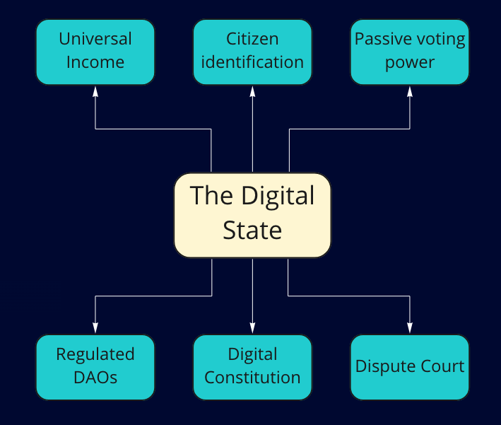

# About

**Blockchain-based decentralised and autonomous platform for organisations and individuals who wish to build a more democratic society.**

The Digital State is a digital implementation of a key democratic institutions based on modern technologies of blockchain, cryptography and decentralisation.

## Our Mission

We strive to bring order and decentralisation of political power to the countries that still remain under a rule of authoritarian government in a peaceful way. With the Digital State - we bring the benifits of a democratic societty to the citizens and organisations while protecting their identity.

### Step 1: Your Freedom of assembly (DAO)

Authoritarians will take away your freedom of assembly. We give you back the freedom to self-organise and make decisions to communities, corporations and other organisations within the digital state. Any participat can anonymously create an organisations and invite other members. Organisations are decentralised and are only governed by it's members - therefore cannot be prosecuted.

Any organisation may publish undisputable manifest, share their goals and create official press releases through a vote of their governing members.

While members of organisations are anonymous and protected - the organisation itself is public and is a source of trust, resilient to miss-information, shut-down, take-over and bribery.

### Step 2: Your freedom to choose constitution (State)

Authoritarians will neglect or rewrite their constitution. We give you back the freedom to make your own constitution and encourage societty to join your governance framework through a peaceful means. Any DAO may announce a State provided that the following 3 criterias are met:

1. State must have a constitution - a document published by a founding DAO that regulates a legislative framework for the State
2. Founding DAO must provide a digital Court - a mechanism that can be used to resolve legal disputes between DAOs
3. Budget and Taxation scheme - a legal and transparent mechanism of funding governance

DAOs may join or leave State of their choosing (leaving State may incur a penalty). While DAO is under the State governance, their decision making can be challenged by other DAOs with the dispute being settled in a digital court. If the state court appears unfair - participating DAOs may decide to leave the State in order to protect their assets and ideals.

### Step 3: Benifits and freedoms to the citizens (Digital Citizenship)

Authoritarians will attempt to restrict and tax citizens. We give citizens their freedom and benifits of universal income. When the State is formed, founding DAO will need to establish citizen identification mechanism. This would usually be off-chain process but it would define some criteria on how to identify personal identity. 

The identity mechanism must offer meet several requirements:

- Any single person may have no more than a single "real" identity (Digital Citizenship)
- A person may have several anonymous profiles (may be a subject to a financial deposit)
- Identity must work on "zero-knowledge" basis

Both real identity and anonymous profile can own things such as property, bonds etc. Anonymous profile is similarly owned by some real identity. Government and any DAO must provide their services to all holders of "real identites" without bias. In most cases services should be provided to the "anonymous profiles" also - which are means for citizens to protect their personal information. 

### Step 4: Voting power

Digital Citizenship allow person to vote digitally. While it is possible to have a conventional style referendums, Digital State introduces new concepts of Voting Power:

- Any digital citizen receives voting tokens on a regular intervals (monthly)
- Voting tokens are non-transferrable and cannot be used until citizen is 18
- A significance of a digital citizen during a vote is proportional to number of investe voting tokens
- Voting tokens can be used in direct-democracy - referendums, petitions or representative-democracy - mayor or senate elections

With a fluid voting power the citizens can point to the most pressing issues, does not discredit youth and allows citizens to appoint good representation through continious support.

## What is the state of the project?

Project has been started in 2021 and has been in active planning phase as well as discussed with various fields of applications as well as researching technological fields.

We are now ready to start the development process.

## How will this project earn money?

The exact process is not defined, but there could be some financial contributions from all Governing DAOs which the core team would be supporting technically.
